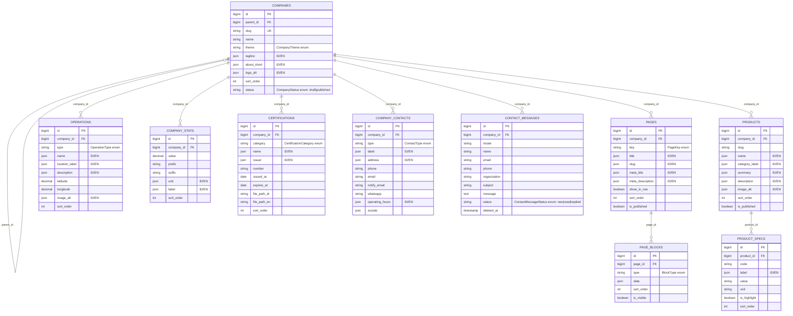

# Entity-Relationship Diagram (ERD) — PT Derco Bara Energy

Dokumen ini memvisualisasikan skema basis data sesuai bagian 8 pada `PRD.md`.

```mermaid
erDiagram
    COMPANIES ||--o{ COMPANIES : "parent_id"
    COMPANIES ||--o{ PAGES : "company_id"
    PAGES ||--o{ PAGE_BLOCKS : "page_id"
    COMPANIES ||--o{ PRODUCTS : "company_id"
    PRODUCTS ||--o{ PRODUCT_SPECS : "product_id"
    COMPANIES ||--o{ OPERATIONS : "company_id"
    COMPANIES ||--o{ COMPANY_STATS : "company_id"
    COMPANIES ||--o{ CERTIFICATIONS : "company_id"
    COMPANIES ||--o{ COMPANY_CONTACTS : "company_id"
    COMPANIES ||--o{ CONTACT_MESSAGES : "company_id"

    COMPANIES {
        bigint id PK
        bigint parent_id FK
        string slug UK
        string name
        string theme "CompanyTheme enum"
        json tagline "ID/EN"
        json about_short "ID/EN"
        json logo_alt "ID/EN"
        int sort_order
        string status "CompanyStatus enum: draft|published"
    }

    PAGES {
        bigint id PK
        bigint company_id FK
        string key "PageKey enum"
        json title "ID/EN"
        json slug "ID/EN"
        json meta_title "ID/EN"
        json meta_description "ID/EN"
        boolean show_in_nav
        int sort_order
        boolean is_published
    }

    PAGE_BLOCKS {
        bigint id PK
        bigint page_id FK
        string type "BlockType enum"
        json data
        int sort_order
        boolean is_visible
    }

    PRODUCTS {
        bigint id PK
        bigint company_id FK
        string slug
        json name "ID/EN"
        json category_label "ID/EN"
        json summary "ID/EN"
        json description "ID/EN"
        json image_alt "ID/EN"
        int sort_order
        boolean is_published
    }

    PRODUCT_SPECS {
        bigint id PK
        bigint product_id FK
        string code
        json label "ID/EN"
        string value
        string unit
        boolean is_highlight
        int sort_order
    }

    OPERATIONS {
        bigint id PK
        bigint company_id FK
        string type "OperationType enum"
        json name "ID/EN"
        json location_label "ID/EN"
        json description "ID/EN"
        decimal latitude
        decimal longitude
        json image_alt "ID/EN"
        int sort_order
    }

    COMPANY_STATS {
        bigint id PK
        bigint company_id FK
        decimal value
        string prefix
        string suffix
        json unit "ID/EN"
        json label "ID/EN"
        int sort_order
    }

    CERTIFICATIONS {
        bigint id PK
        bigint company_id FK
        string category "CertificationCategory enum"
        json name "ID/EN"
        json issuer "ID/EN"
        string number
        date issued_at
        date expires_at
        string file_path_id
        string file_path_en
        int sort_order
    }

    COMPANY_CONTACTS {
        bigint id PK
        bigint company_id FK
        string type "ContactType enum"
        json label "ID/EN"
        json address "ID/EN"
        string phone
        string email
        string notify_email
        string whatsapp
        json operating_hours "ID/EN"
        json socials
    }

    CONTACT_MESSAGES {
        bigint id PK
        bigint company_id FK
        string locale
        string name
        string email
        string phone
        string organization
        string subject
        text message
        string status "ContactMessageStatus enum: new|read|replied"
        timestamp deleted_at
    }
```
